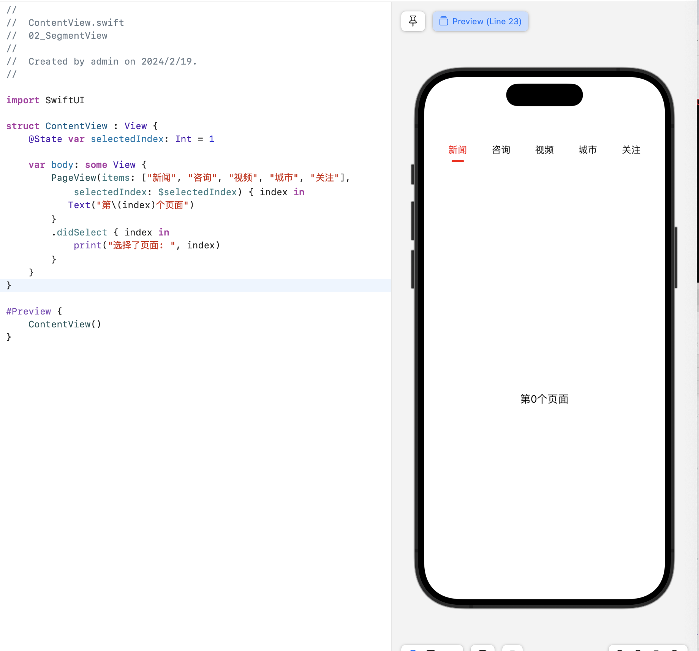

# swiftUI 学习Demo
用于swiftUI学习的Demo，用swiftUI编写了常见的UI页面
## Demo1.登录页面

## Demo2.segmented view分类切换
SwiftUI中，目前还没有特别强大的分类切换组件。 为适应实际项目需求，采用UIViewControllerRepresentable协议，包装 JXSegmentedView成swiftUI视图来实现。

